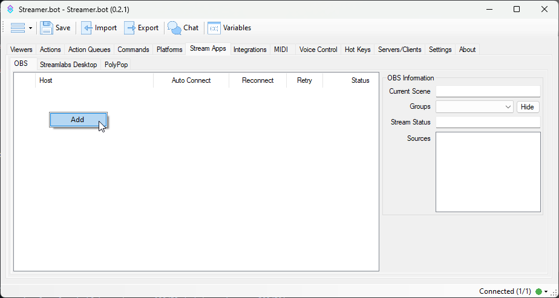
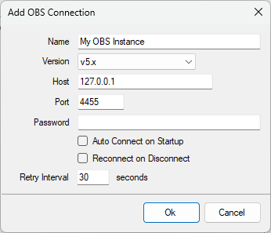

# OBS Studio
Configure Streamer.bot to interact with your OBS Studio instances

::callout{icon=i-mdi-warning color=amber to=/get-started/setup#obs-studio}
You must enable the **OBS WebSocket** connection. Check out the [Get Started Guide](/get-started/setup#obs-studio) for details.
::

---

::callout{icon=i-mdi-navigation}
Navigate to **Stream Apps > OBS** in Streamer.bot
::

## Configuration
To add a new connection, <kbd>Right-Click</kbd> anyhere in the panel area and select `Add`:

Configuration options are outlined below:

::field-group
  ::field{name=Name type=Text required}
  Enter any name or label to describe this OBS instance, e.g. `Local OBS`
  ::

  ::field{name=Version type=Select required}
    Select the version of `OBS WebSocket` to use for this connection.

    ::callout{icon=i-mdi-alert color=amber}
    As of `OBS Studio v28.0.0`, `OBS WebSocket v5` is included by default.
    - To continue using `OBS WebSocket v4.9+`, you must install the `obs-websocket-4.9.1-compat` plugin
    - **It is recommended to update to if you are currently using an older version.**
    ::
  ::

  ::field{name=Host type=Text required default="127.0.0.1"}
  Enter the host address of your OBS WebSocket Server

  If OBS Studio is running on the same machine as Streamer.bot, keep `127.0.0.1`

  For multi-pc setups you can configure this with another LAN IP address, e.g. `192.168.1.10`
  ::

  ::field{name=Port type=Number required default=4455}
  Enter the port of your OBS WebSocket Server
  - Default: `4455` (v5+) or `4444` (v4.9+)

    It is recommended to keep the defaults unless you are using multiple OBS portable installs on the same desktop.
  ::

  ::field{name=Password type=Text}
  If you configured authentication in OBS, enter the password for your OBS WebSocket Server
  ::

  ::field{name="Auto Connect on Startup" type=Toggle}
  Automatically connect to this OBS Studio instance when Streamer.bot starts up
  ::

  ::field{name="Reconnect on Disconnect" type=Toggle}
  Automatically reconnect to this OBS Studio instance when the connection is disrupted
  ::

  ::field{name="Retry Interval" type=Number default=30}
  Change the interval of reconnection attempts when `Reconnect on Disconnect` is enabled
  ::
::

## Context Menu
<kbd>Right-Click</kbd> on a configured connection to reveal the context menu:

#### `Add`
Add a new OBS Studio connection

#### `Edit`
Edit the selected OBS Studio connection

#### `Delete`
Delete the selected OBS Studio connection

#### `Auto Connect`
Quickly toggle the `Auto Connect on Startup` configuration option for the selected connection

#### `Reconnect`
Quickly toggle the `Reconnect on Disconnect` configuration option for the selected connection

#### `Default`
Set this connection as the default when importing actions

::callout{icon=i-mdi-lightbulb color=amber}
If no default is set, imported actions will default to the first connection in the list
::

#### `Force`
Temporarily override **all** OBS Studio connections to use the selected connection.

::callout{icon=i-mdi-alert color=amber}
This setting does **not** persist when you restart Streamer.bot
::

#### `Update All Actions To...`
Reconfigure all actions utilizing an OBS Studio connection to use the selected connection

#### `Connect`
Manually attempt to connect to the selected connection

## Status Panel
Selecting a connected OBS instance in the left panel will reveal additional realtime information about that instance on the right panel.

#### `OBS Information`
Shows the version numbers of OBS Studio and WebSocket plugin

#### `Current Scene`
Shows the name of the currently broadcasting scene on the selected connection

#### `Stream Status`
Shows the status of the current streaming and recording activity

#### `Sources`
Lists all sources present on the currently selected scene

## Usage
::callout{icon=i-mdi-bookmark color=green to=/api/sub-actions/obs/get-current-scene}
Explore all **OBS Studio sub-actions** and their variables at [API References > Sub-Actions > OBS Studio](/api/sub-actions/obs/get-current-scene)
::

::callout{icon=i-mdi-bookmark color=green to=/api/triggers/obs/obs-event}
Explore all **OBS Studio triggers** and their variables at [API References > Triggers > OBS Studio](/api/triggers/obs/event)
::